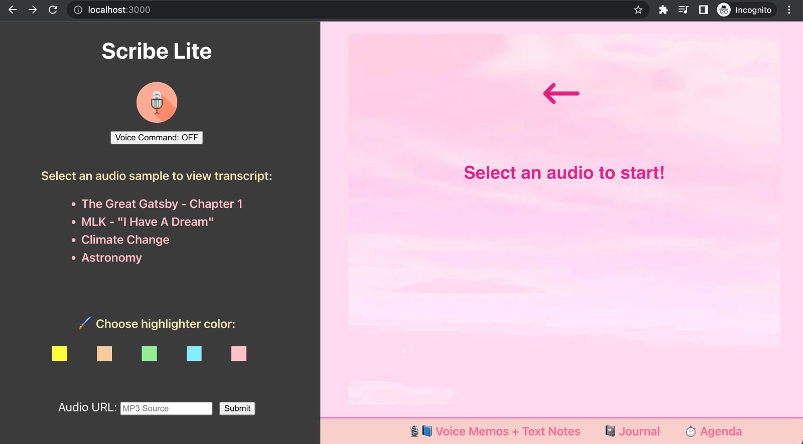
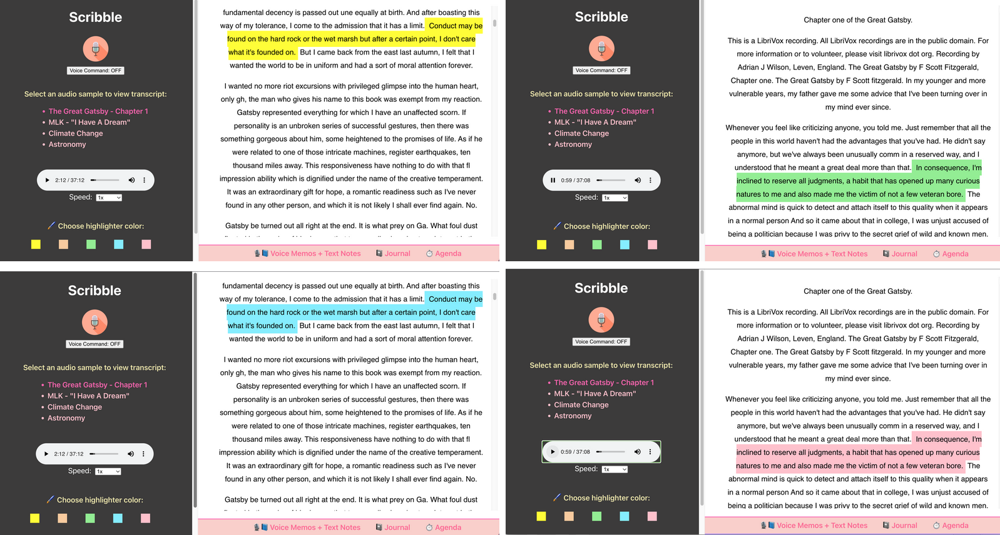
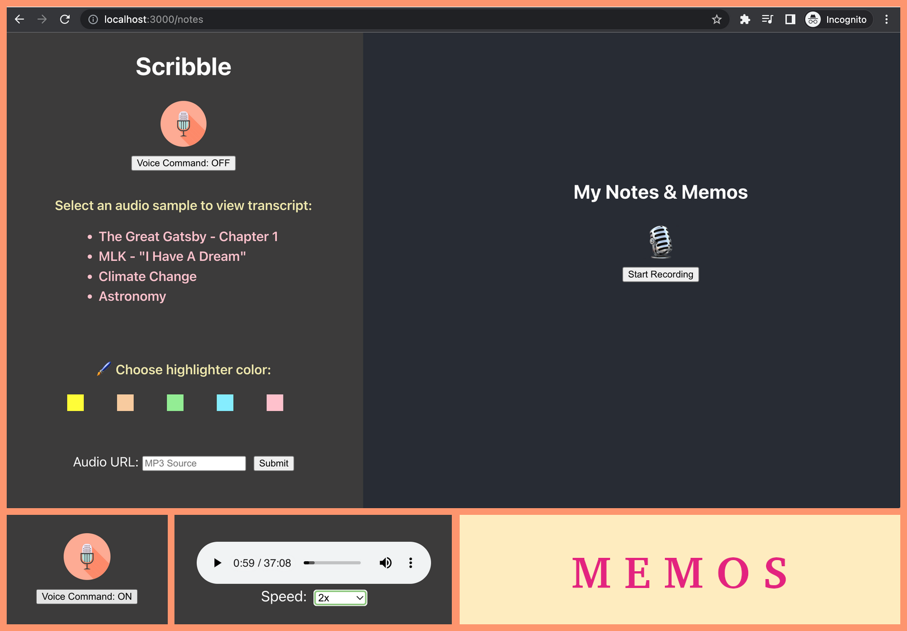
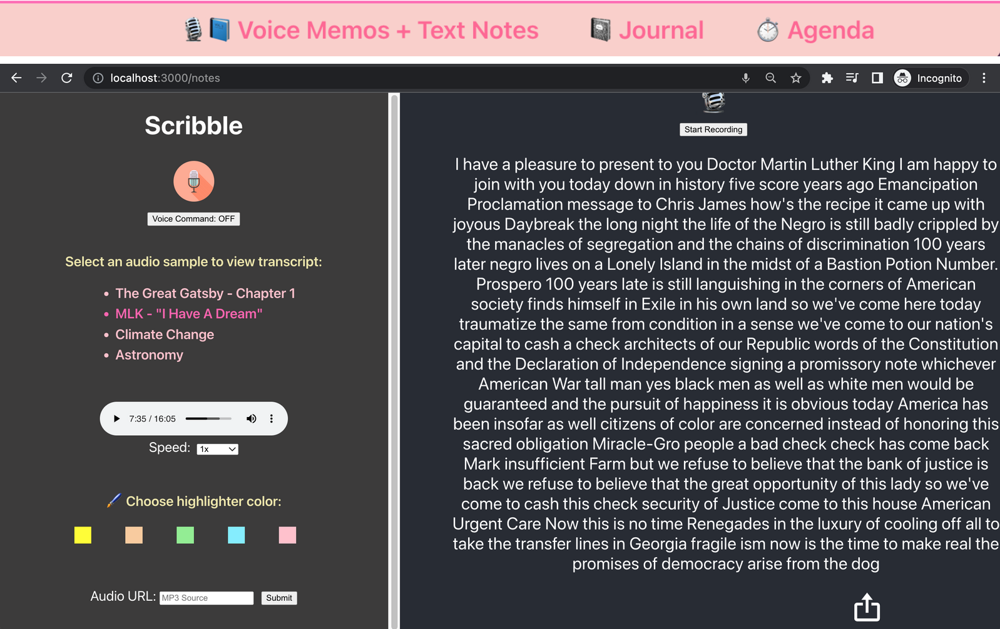
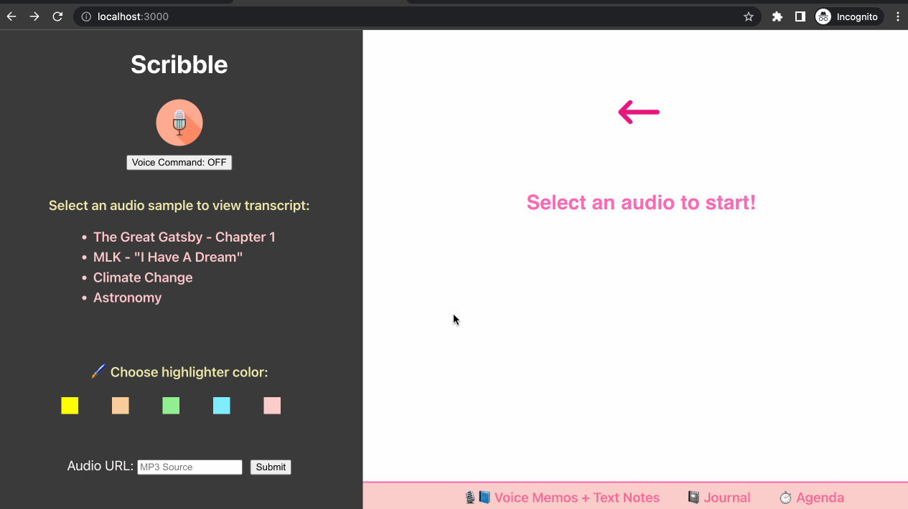
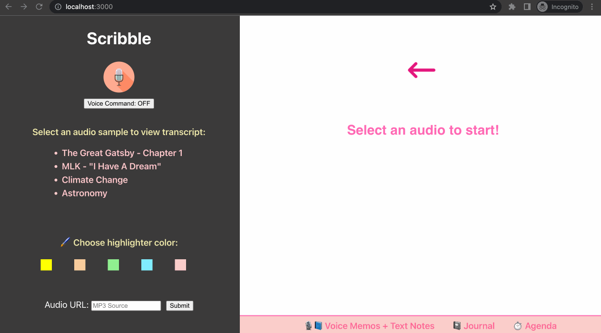
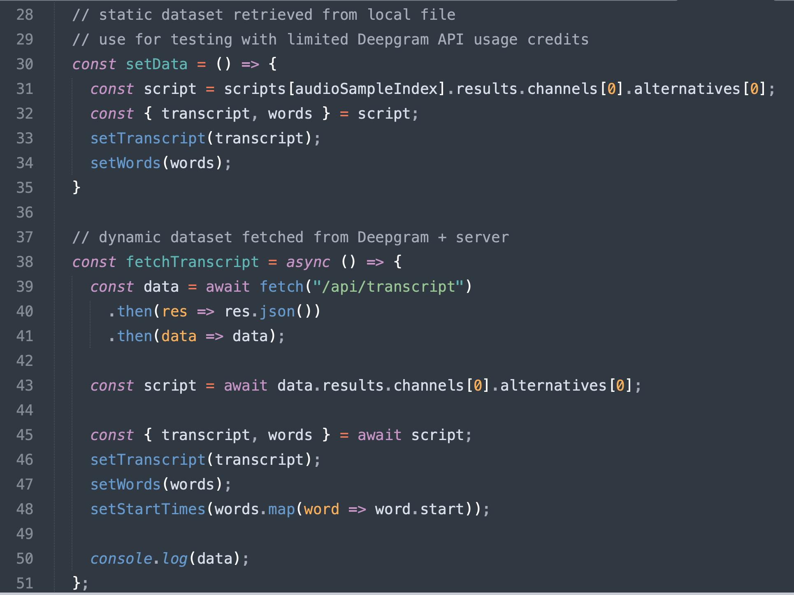

# Scribe Lite

🌀 **[Installation](#installation)** &nbsp; &nbsp; 🌀 **[Configuration](#configuration)** &nbsp; &nbsp; 🌀 **[Project Structure](#project-structure)**  &nbsp; &nbsp; 🌀 **[What it is](#what-it-is)** &nbsp; &nbsp; 🌀 **[Screenshots](#screenshots)** &nbsp; &nbsp; 🌀 **[GIF Demo](#gif-demo)** &nbsp; &nbsp; 🌀 **[Challenges](#challenges)** &nbsp; &nbsp; 🌀 **[Future Plans](#future-plans)**

 

## Installation 
1. Clone this repository
2. Run **`cd server && npm install`** to install all server dependencies
3. Run **`npm start`** from `server/` dir to run the node server on localhost:5000
5. Open a new Terminal tab, cd to `client/` dir, and run **`npm install`** to install all client dependencies
6. Run **`npm start`** to start the React app on localhost:3000

 

## Configuration
Rename server side **`.env.example`** to **`.env`** and add your Deepgram_API_Key.  
React **`.env`** file contains sample pre-recorded audios for quick demo and testing.

\* Voice commands are supported only in Chrome browser.

 

## Project Structure

	
Expand to view project tree
 
	
	root
	├─ .gitignore
	├─ assets
	│  ├─ bugs
	│  ├─ icon
	│  ├─ demo
	│  ├─ img
	├─ node_modules
	├─ public
	│  ├─ index.htrml
	├─ server
	│  ├─ controllers
	│  │  ├─ transcript.controller.js
	│  ├─ routes
	│  │  ├─ index.js
	│  ├─ services
	│  │  ├─ transcript.service.js
	│  ├─ node_modules
	│  ├─ .env.example
	│  ├─ index.js
	│  ├─ package.json
	├─ src
	│  ├─ components
	│  │  ├─ Audio
	│  │  │  ├─ Audio.jsx
	│  │  │  ├─ style.css
	│  │  ├─ Navbar
	│  │  │  ├─ Navbar.jsx
	│  │  │  ├─ style.css
	│  │  ├─ Notes
	│  │  │  ├─ Notes.jsx
	│  │  │  ├─ style.css
	│  │  ├─ Transcript
	│  │  │  ├─ Transcript.jsx
	│  │  │  ├─ style.css
	│  │  ├─ Voice
	│  │  │  ├─ Voice.jsx
	│  │  ├─ index.js
	│  ├─ data
	│  ├─ App.css
	│  ├─ App.js
	│  ├─ index.css
	│  ├─ index.js
	│  ├─ setupProxy.js
	├─ .env
	├─ .gitignore
	├─ package.json
	├─ webpack.config.js 
	

 

## What It Is

A lightweight speech-to-text transcription reader for users who want to follow along with the contents contained in pre-recorded audios but struggle with hearing or need supplementary text to aid in information processing. With speed adjusments, colored highlights, voice commands, and other features in the works, the app delivers an interactive, seamless experience for readers and listeners that makes any audio content widely accessible, easy to absorb, and quick to understand.

Personally, this is an app that I would use myself (that's how I came up with it 🙂) because it's hard to listen to long audio and video recordings from start to end when there are no timestamp markers, a script or topic agenda to follow, or a selector to adjust speed. This might sound weird, but I have a harder time processing speech that is spoken slowly than I do for faster-paced speech. I also deal with non-stop buzzing/ringing in my ears from tinnitus, an incurable condition, so my hearing is slightly impaired. With this app, users can speed read alongside the audio playing or on mute in half the time or less.

As we get older, our ability to hear certain frequencies diminishes with time. I cannot hear pitches beyond a certain frequency expected from my age group which is unfortunate and probably an indicator that I should do better in trying to preserve what I have left of my hearing. As much as this app is meant to help people who are deaf or people with hearing loss, catering to different learning styles and abilities (visual vs/in conjunction with audio), it also serves users who cannot rely on audio-only speech for any other reason (e.g. working or studying in a public library or quiet space without earbuds/headphones, in a noisy environment, wanting to preserve & protect auditory health from further deterioration, text translations for foreign language speakers/learners, etc). Providing audio as text built upon automated speech recognition AI, like Deepgram, improves accessibility by offering a plethora of supportive features and possibilities that are not supported by audio alone. 

The current version is missing many of the <a href='#future-plans'><strong>features I had envisioned</strong></a>. I didn't get around to building out the app to what I want it to be, so what you see right now is more of a starter project with the bare bones laid out.

 

## Screenshots

**†** *Scribe Lite* is the first name that I came up with.  
&nbsp; &nbsp;Then I renamed my project as *Scribble*...  
&nbsp; &nbsp;but that looked and sounded worse to me...  
&nbsp; &nbsp;so I went back to *Scribe Lite* 😅  

 

## GIF Demo

**†** Please click on each GIF to restart from frame 1 &nbsp; &nbsp; **<a href='assets/demo/demo-1.gif'>GIF 1</a> ~ <a href='assets/demo/demo-2.gif'>GIF 2</a>**  

**†** The mouse + frames freezing at the end do not reflect app performance. Runtime was smooth during recording. This is an issue with my PC not being able to handle screen recording with multiple processes and programs running. Unfortunately, these were the only two GIFs I was able to screen capture. The remaining batch of recordings turned out like **<a href='assets/demo/yikes.gif'>this</a> 😪**. I'll see if I can screen record with another software or turn the GIF into a  video demo later.  

 

## Challenges
- Picking one idea from a list of several to build

- I ran into a roadblock with POST request due to router middleware and did not have enough time to troubleshoot. Hence, I could not pass any data to the server, which restricted what I was able to do. This is why submitting an audio url via user input does not work (yet). **<a href='assets/bugs/POST%20504.png'>504 Error</a> - <a href='assets/bugs/POST%20Router%20Error.png'>router middleware issue</a>**

- I also encountered a bug with start times, where the loop skipped over any value at index 1, so I had to manually input (hardcode) the start time at index 1, despite the rest of the start times being auto generated.

- Deepgram's transcriptions are mostly accurate, but you will notice a few misspellings and punctuation errors here or there. This is to be expected considering the variances in audio quality, background noise, pace of speech, accents, etc. I corrected a few words, but it wasn't as simple as proofreading and correcting errors in the transcript property value. The algorithm relies on the start time of the first word and the end time of the last word in every sentence to display proper highlighting synced to audio. This means that any word I add or delete to the transcript must also be added to the words array in the datasets to maintain accuracy in word count and indexing, which is a daunting feat considering the transcripts are hundreds to thousands of words long. So past a couple of edits, I left the transcription untouched so as not to throw off the highlighter timing. You can view the minimal changes I made to the transcripts by diff comparing **<a href='src/data/unedited'>the original datasets</a>** with **<a href='src/data/edited'>the edited datasets</a>** side by side, split view in a code editor.

- As a quick solution, I copied over the transcripts fetched from Deepgram in server side to client side and imported the JSON data to the Transcript component. The two functions in **`src/components/Transcript/Transcript.jsx`** appear to do the same thing, but there is an important difference - **`setData()`** uses data that is imported statically from the frontend whereas **'fetchTranscript()'** fetches data dynamically from the backend. The first function can only retrieve stored transcripts (used in the prototype demo), but the second function will allow the fetching of any transcript (ideal). For development and testing with limited API credits, storing data locally works out well.

  

 

## Future Plans
Features that I plan to add in future iterations:
- audio/video URL, file upload, video support
- voice commands: adjust speed, text size, style, forward, backward, take - speech-to-text notes 
	- editorial, commentary, critique, etc.
- real-time voice notes + comments at timestamps, meeting minutes, memos, brainstorming, ideas, free flow
- collapsible, resizable left column menu for full screen reader with autoscroll
- generate agenda + timestamps to jump to (useful for long audios + videos)
- dark mode, +/- highlighter shades
- clip, save, share, export direct quotes + notes
- take notes + comment on sections for study & reference
- multi-language support, translations in multiple languages
- glossary for terms, interpretations, symbols, motifs
- color coded highlights distinguised by speaker diarization for different audio formats 
	- meeting, podcast, video, speech, script, literature, poetry, song*
- build another tool for recording & song writing lyrics (return to my 1st idea during brainstorming)
	- there are other tools I'd like to build as well since speech-to-text is such a versatile application with many use cases
